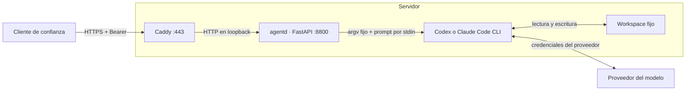

# cli-harness-expose-starter

**Caddy → daemon HTTP autenticado → harness por CLI.** Un punto de partida
pequeño para exponer Codex o Claude Code como un servicio en un servidor propio.

Extrae el patrón arquitectónico de `doe-stack`. No incluye Aztec Agents, consola
web, Supabase, provisionador, Docker socket, administración de usuarios ni
workspaces multiusuario. La implementación de este starter es independiente y
reduce el alcance a un workspace y una ejecución simultánea por servidor.

## Conveniencia y responsabilidad de quien lo utiliza

**Este repositorio es un starter, no una garantía de seguridad ni una solución
adecuada para todos los escenarios. Quien lo utilice debe evaluar su conveniencia
para cada caso**, considerando los datos, permisos, credenciales, usuarios,
contenido externo, costos y consecuencias de las acciones del agente.

Está pensado para un propietario o un grupo de plena confianza. Tener un token
válido permite dar instrucciones a un agente capaz de ejecutar comandos con
los permisos del usuario de sistema del daemon. No lo trates como una API de
operaciones limitadas ni lo compartas entre clientes que deban estar aislados.

La ejecución viene **deshabilitada**. `HARNESS_ALLOW_UNSAFE_CLI=1` es un opt-in
explícito: habilita los flags de bypass de permisos del CLI. Antes de activarlo,
evalúa e implementa el aislamiento externo necesario. Este interruptor no crea
un sandbox, no valida tu despliegue y no vuelve seguras las instrucciones.

## Arquitectura



- **Caddy** gestiona TLS y certificados, aplica un límite de cuerpo y reenvía
  al daemon local. No autoriza comandos, no interpreta prompts y no aísla al CLI.
- **agentd** verifica el Bearer, valida el pedido, admite un solo trabajo y
  convierte la salida del proceso en JSON o eventos SSE.
- **Harness** interpreta el pedido, usa el modelo y ejecuta herramientas. El
  directorio de trabajo y proveedor los fija el operador, nunca el request.
- **Workspace** contiene instrucciones y archivos. `cwd` es un directorio
  inicial, no una frontera de acceso. Cada request inicia un turno nuevo;
  este starter no implementa reanudación de sesiones.

## Inicio local

Requisitos: Linux o macOS, Python 3.11+, [uv](https://docs.astral.sh/uv/), y el
CLI seleccionado instalado y autenticado bajo el usuario que correrá el daemon.
Windows no está soportado por la limpieza POSIX de grupos de procesos.

```bash
git clone https://github.com/vasquez343/cli-harness-expose-starter.git
cd cli-harness-expose-starter
uv sync --frozen
cp .env.example .env
chmod 600 .env
uv run agentd token
```

Copia el token generado a `AGENTD_TOKEN` en `.env`. Selecciona `codex` o
`claude` con `HARNESS_PROVIDER` y revisa el workspace. Los archivos de ejemplo
son instrucciones al modelo, no políticas impuestas por el sistema operativo.

**Después de evaluar el aislamiento de este entorno**, puedes cambiar
`HARNESS_ALLOW_UNSAFE_CLI=1`. Sin ese cambio, `/health` responde y los endpoints
de ejecución devuelven 503. No ejecutes el daemon como root.

El daemon lee variables de entorno; no carga `.env` automáticamente. Para
desarrollo, carga únicamente un archivo `.env` propio y de confianza:

```bash
set -a
. ./.env
set +a
uv run agentd serve
```

Escucha en `127.0.0.1:8800`. Los CLIs usan su configuración local y su método
de autenticación; el starter no inicia login, compra créditos ni configura el
modelo. Evalúa condiciones de uso, tratamiento de datos y costos de tu proveedor.

## API

Desde otra terminal, con `AGENTD_TOKEN` cargado:

```bash
curl --fail-with-body http://127.0.0.1:8800/run \
  -H "Authorization: Bearer $AGENTD_TOKEN" \
  -H 'Content-Type: application/json' \
  -d '{"prompt":"Explica qué archivos hay en este workspace. No los modifiques."}'
```

Respuesta de éxito: `{"type":"result","ok":true,"provider":"codex","text":"..."}`.
El contenedor es JSON; `text` es texto del modelo, no JSON validado contra schema.

```bash
curl --fail-with-body -N http://127.0.0.1:8800/stream \
  -H "Authorization: Bearer $AGENTD_TOKEN" \
  -H 'Content-Type: application/json' \
  -d '{"prompt":"Describe el workspace sin modificar archivos."}'
```

`/stream` emite eventos SSE con `data` del proveedor y un evento terminal
`result` o `error`. El esquema de los eventos originales depende del CLI. Pueden
contener contenido de archivos, llamadas a herramientas e información sensible:
no los publiques, no los registres indiscriminadamente y no los renderices como
HTML sin sanitizar. Solo `result` con `ok=true` significa éxito. Un HTTP 200 de
streaming no significa que la ejecución haya terminado correctamente.

| Ruta / estado | Comportamiento |
|---|---|
| `GET /health` | Público; comprueba que el daemon responde, no disponibilidad del CLI ni credenciales. |
| `POST /run` | Espera el resultado; error de ejecución → 502. |
| `POST /stream` | SSE; errores posteriores al inicio viajan como evento `error`. |
| 401 | Bearer ausente o incorrecto. |
| 503 | Token sin configurar o ejecución no habilitada. |
| 409 | Workspace ocupado; no se encola el pedido. |
| 422 | Prompt vacío o superior a 16.000 caracteres. |

Un request `/run` desconectado puede seguir hasta terminar o agotar su timeout.
El cierre del stream limpia el generador y su grupo de procesos. Los límites no
equivalen a una transacción: cancelar no deshace archivos ni acciones externas.

## Configuración

| Variable | Default | Uso |
|---|---|---|
| `AGENTD_TOKEN` | vacío | Token del API; vacío bloquea ejecución. |
| `HARNESS_PROVIDER` | `codex` | `codex` o `claude`; lo elige el operador. |
| `HARNESS_WORKSPACE` | `./workspace` | Directorio existente, preferiblemente absoluto en producción. |
| `HARNESS_ALLOW_UNSAFE_CLI` | `0` | `1` habilita bypass de permisos del harness. |
| `HARNESS_IDLE_TIMEOUT` | `120` | Segundos máximos esperando salida/progreso del proceso. |
| `HARNESS_TOTAL_TIMEOUT` | `900` | Techo de tiempo del proceso; un trabajo activo también puede cancelarse. |
| `HARNESS_MAX_OUTPUT_BYTES` | `8388608` | Límite combinado de stdout/stderr; también tope separado del texto final. |
| `HARNESS_ENV_ALLOWLIST` | vacío | Variables adicionales que se entregan al CLI, separadas por comas. |

Se conserva un entorno básico (`PATH`, `HOME`, idioma, temporales y rutas de
certificados). Para credenciales del proveedor por entorno, añade solo los nombres
necesarios a la allowlist. `AGENTD_TOKEN` nunca se hereda mediante esa lista.
**Esto no impide leer un archivo de secretos accesible al mismo usuario ni
garantiza ocultar el entorno del daemon a procesos con sus mismos permisos.**

Ejecuta **un solo worker ASGI y una sola instancia por workspace**. El bloqueo
es local al proceso; varios workers o réplicas romperían esa exclusión.

## Despliegue con Caddy y systemd

Los archivos de `deploy/` son plantillas para Linux. No hay instalador que
modifique automáticamente usuarios, firewall, servicios o Caddy.

1. Crea un usuario dedicado `agentd` sin sudo y con home `/var/lib/agentd`.
2. Coloca el código en `/opt/cli-harness-expose-starter`, propiedad del
   administrador. Instala con `uv sync --frozen --no-dev` usando un Python
   3.11+ del sistema accesible al servicio, fuera de `/home` y `/root`.
3. Crea `/var/lib/agentd/workspace`, propiedad de `agentd`, y copia allí las
   instrucciones que corresponda. Mantén el código del servicio sin escritura
   para `agentd`.
4. Instala el CLI en una ruta accesible del `PATH` del servicio y autentícalo
   con el usuario `agentd` y `HOME=/var/lib/agentd`. No reutilices el home personal
   de un administrador. Verifica que tus herramientas funcionen con el hardening.
5. Crea `/etc/agentd.env` basado en `.env.example`, propiedad de root, modo 600.
   Usa `HARNESS_WORKSPACE=/var/lib/agentd/workspace` y un token nuevo. systemd
   lee el archivo antes de cambiar de usuario. No agregues `export` a ese archivo.
6. Revisa y copia `deploy/agentd.service` a `/etc/systemd/system/agentd.service`.
   Valídalo en Linux con `systemd-analyze verify`, luego `daemon-reload` y
   `enable --now agentd`. Revisa el journal y prueba primero por loopback.
7. Instala Caddy. Integra el bloque de `deploy/Caddyfile` en tu configuración
   existente, sustituye el dominio, configura DNS y abre solo los puertos que
   necesites (normalmente 80/443 para Caddy). No publiques 8800.
8. Ejecuta `caddy validate --config /etc/caddy/Caddyfile` antes de recargar.
   Comprueba desde fuera que no puedes alcanzar 8800 y que `/run` sin token
   falla también a través de HTTPS.

La unidad propuesta añade `NoNewPrivileges`, filesystem mayormente de solo
lectura, home privados ocultos, temporales privados, límites de CPU/memoria/PIDs
y `KillMode=control-group`. Son restricciones adicionales; **no se afirma que
equivalgan a una VM ni que sean compatibles con cualquier herramienta**.

## Seguridad: implementado y pendiente de evaluar

### Controles incluidos

- Bearer comparado en tiempo constante; sin token no hay ejecución.
- Puerto local por defecto y plantilla de proxy HTTPS con límite de 128 KB.
- Prompt de tamaño acotado; ejecutable, argumentos y workspace fijados por el servidor.
- `create_subprocess_exec` sin shell; prompt por stdin, nunca concatenado en un comando.
- Una ejecución a la vez; rechazo 409, sin cola ilimitada.
- Límites de inactividad, duración, bytes y línea JSONL.
- Limpieza del grupo POSIX de procesos, también al cerrar el generador.
- Entorno del hijo por allowlist; no se copia todo el entorno del daemon.
- Bypass del CLI únicamente después de opt-in explícito.

### Recomendaciones para quien adopte el starter

Evalúa estas medidas según tu caso y verifica su funcionamiento antes de exponer
el servicio. No todas son necesarias o suficientes para todos los escenarios.

1. **Aislamiento externo:** considera un contenedor endurecido o VM por dominio
   de confianza, usuario no root, volúmenes mínimos y ningún socket Docker ni
   montaje del host innecesario. Un `cwd` y un usuario dedicado no son una jaula.
2. **Acceso privado:** si solo lo utiliza su propietario, considera VPN o una
   red privada. HTTPS cifra el transporte; no limita lo que un token permite hacer.
3. **Credenciales y autorización:** rota tokens, distribúyelos fuera del código
   y define revocación. El token actual da acceso completo al workspace. No hay
   permisos por persona, por operación ni separación de usuarios.
4. **Secretos:** separa credenciales del daemon y del agente; usa credenciales
   con alcance mínimo. Para una separación fuerte, considera procesos con usuarios
   distintos y un broker de credenciales/herramientas. Ocultar un secreto en la UI
   no impide leerlo desde el filesystem o imprimirlo en la salida del CLI.
5. **Acciones sensibles:** `AGENTS.md`, `CLAUDE.md` y pedir confirmación son reglas
   para el modelo. Si necesitas garantía, impón autorización fuera del modelo,
   antes de ejecutar herramientas que envían, pagan, publican o borran.
6. **Abuso y costos:** añade rate limiting por identidad/IP, cuotas de uso,
   límites de disco/volúmenes, alertas y políticas de reintentos. No hay
   idempotencia: reenviar un request puede repetir acciones y cargos.
7. **Red:** evalúa restricciones de salida y acceso a redes internas/metadata.
   Un proceso con red puede enviar datos fuera del servidor; Docker por sí solo
   no define una política de egress ni resuelve prompt injection.
8. **Procesos y auditoría:** un descendiente puede crear otra sesión y escapar
   del grupo POSIX. Usa cgroups/contenedores para contención más fuerte y logs
   externos protegidos si necesitas trazabilidad que el agente no pueda alterar.
9. **Límites HTTP:** Caddy limita el cuerpo antes de llegar a la app; el límite
   de caracteres del modelo de request ocurre después de parsear JSON. Mantén el
   daemon en loopback y añade límites equivalentes si cambias el proxy.
10. **Cadena de suministro:** fija versiones de CLIs, Python y dependencias,
    revisa actualizaciones, prueba sus flags y eventos JSONL, y considera escaneo
    de vulnerabilidades. `uv.lock` fija Python packages; no instala ni fija los CLIs.

## Desarrollo y verificación

```bash
uv sync --frozen
uv run pytest -q
```

Las pruebas usan procesos Python y CLIs ficticios: comprueban auth, exclusión
mutua, errores SSE, límites, entrega del prompt como datos, entorno y limpieza
de descendientes. No consumen modelos, no usan credenciales reales y no prueban
un VPS real. Los flags se contrastaron con la ayuda local de Codex y Claude;
eso no sustituye una prueba de integración de tus versiones y autenticación.

Valida aparte las plantillas de Caddy/systemd en el host destino. No hay auditoría
integral, pentest, certificación ni garantía de aislamiento asociados al starter.

## Estructura

```text
agentd/       configuración, autenticación HTTP y ejecución del CLI
deploy/       plantillas Caddy y systemd
workspace/    instrucciones de ejemplo, sin datos ni credenciales
tests/        verificaciones locales con procesos ficticios
.env.example  configuración sin secretos
uv.lock       dependencias reproducibles de Python
```
